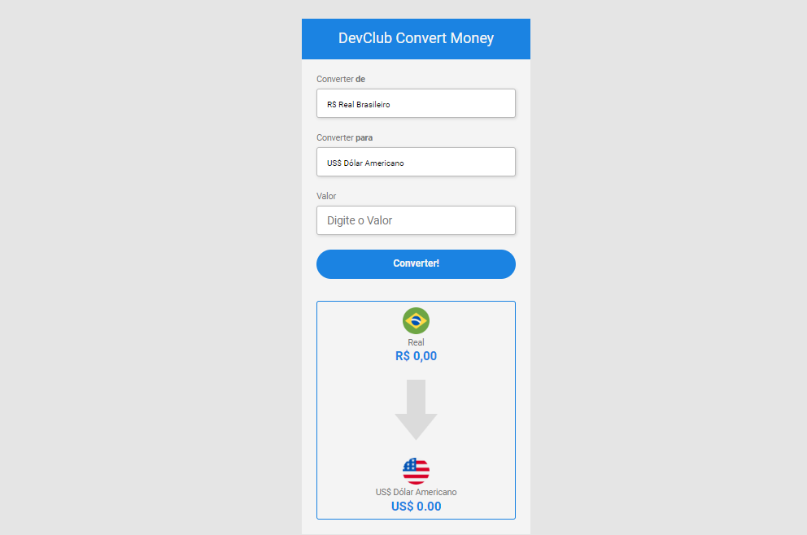

<h1> Conversor de Moeda </h1>

 Conversor de moedas que converte um valor em Real para Dólar, Euro, Iene, Peso Argentino ou Bitcoin.

Nessa aplicação fiz o uso de uma API que pega o valor da moeda em tempo real. Então essa aplicação sempre será útil. 

<h3> Neste projeto utilizei as seguintes tecnologias: </h3>

 
 
 
 

   
 <h3> Imagem do Conversor </h3>
 
   
 <h3> Link do projeto </h3>
 <a href="https://conversor-de-moedas-devclub.netlify.app/">Projeto DevClub - Conversor de Moedas</a>
 
 
 
